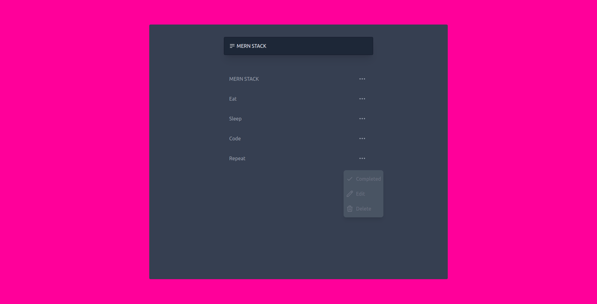

## `Table of Contents`

* [ About The App](#about)
* [ Prerequisites](#pre)
* [ Dependencies](#dependencies)
* [ Install and Run](#iar)

<a name="about"></a>

## `About the application`
To Do is a task management app that helps you stay organized and manage your daily routine. Take notes, record collections, plan an event or set reminders to increase your productivity and focus on what is important to you.

## `App looks like`


<a name="pre"></a>

## `Prerequisites`

### <a href="https://nodejs.org/en/" target="_blank"> 
  v16.13.0 
</a> 


<a name="dependencies"></a>

## `Dependencies`

| name  | version |
| ------------- | ------------- |
| @heroicons/react| ^1.0.6 |
| tailwindcss| ^3.0.24 |


<a name="iar"></a>

## `Install and Run`

Download [ZIP](https://github.com/davitlabadze/mern-todo/archive/refs/heads/master.zip) or Clone repository

```bash
git clone https://github.com/davitlabadze/mern-todo.git
```
#### `Copy .env file`
```bash
cp .env.example .env
```

#### `Install Node modules`

```bash
npm install
```

#### `Run server`

```bash
npm start
```


